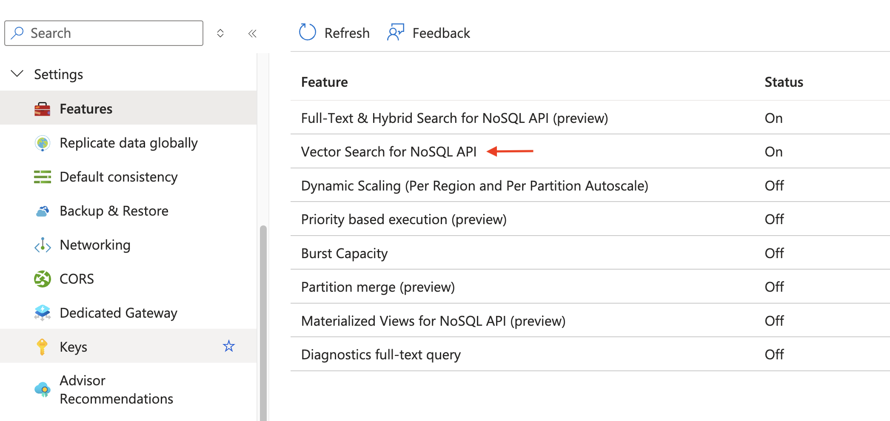

# Get started with Vector Search in Azure Cosmos DB

This is a guide for folks who are looking for a way to quickly and easily try out the [Vector Search feature in Azure Cosmos DB for NoSQL](https://learn.microsoft.com/en-us/azure/cosmos-db/nosql/vector-search). This app uses a simple dataset of movies to find similar movies based on a given criteria. It's implemented in four languages - Python, TypeScript, .NET and Java. There are instructions that walk you through the process of setting things up, loading data, and then executing similarity search queries.

A vector database is designed to store and manage vector embeddings, which are mathematical representations of data in a high-dimensional space. In this space, each dimension corresponds to a feature of the data, and tens of thousands of dimensions might be used to represent data. A vector's position in this space represents its characteristics. Words, phrases, or entire documents, and images, audio, and other types of data can all be vectorized. These vector embeddings are used in similarity search, multi-modal search, recommendations engines, large languages models (LLMs), etc.

## Prerequisites

You will need:

- An Azure subscription. If you don't have one, you can create a [free Azure account](https://azure.microsoft.com/en-us/free/). If for some reason you cannot create an Azure subscription, [try Azure Cosmos DB for NoSQL free](https://cosmos.azure.com/try/).
- Once that's done, go ahead and [create an Azure Cosmos DB for NoSQL account](https://learn.microsoft.com/en-us/azure/cosmos-db/nosql/how-to-create-account?tabs=azure-cli)
- [Create an Azure OpenAI Service](https://learn.microsoft.com/en-us/azure/ai-services/openai/how-to/create-resource?pivots=web-portal#create-a-resource) resource. Azure OpenAI Service provides access to OpenAI's models including the GPT-4o, GPT-4o mini (and more), as well as embedding models. In this example, we will use the `text-embedding-ada-002` embedding model. [Deploy this model](https://learn.microsoft.com/en-us/azure/ai-services/openai/how-to/create-resource?pivots=web-portal#deploy-a-model) using the Azure AI Foundry portal.

> I am assuming you have the required programming language already setup. To run the Java example, you need to have [Maven installed](https://maven.apache.org/install.html) (most likely you do, but I wanted to call it out).

## Configure Integrated Vector Database in Azure Cosmos DB for NoSQL

**Enable the feature**

This is a one-time operation - you will need to explicitly [enable the vector indexing and search feature](https://learn.microsoft.com/en-us/azure/cosmos-db/nosql/vector-search).



**Create database and container**

Once you have done that, go ahead and create a database and collection. I created a database named `movies_db` and a container named `movies` with the partition key set to `/id`.

**Create policies**

You will need to configure a vector embedding policy as well as an indexing policy for the container. For now, you can do it manually via the Azure portal (it's possible to do it programmatically as well) as part of the collection creation process:


> Make sure you use the same policy information as per the image above, at least for this sample app.

**Choice of index type**

Note that I have chosen the `diskANN` index type which and a dimension of `1536` for the vector embeddings. The embedding model I chose was [text-embedding-ada-002 model and it supports dimension size of 1536](https://learn.microsoft.com/en-us/azure/search/cognitive-search-skill-azure-openai-embedding#supported-dimensions-by-modelname). I would recommend that you stick to these values for running this sample app. But know that you can [change the index type](https://learn.microsoft.com/en-us/azure/cosmos-db/nosql/vector-search#vector-indexing-policies) but will need to change the embedding model to match the new dimension of the specified index type.

Alright, lets move on.

## Load data in Azure Cosmos DB

To keep things simple, I have a small dataset of movies in JSON format (in [movies.json](movies.json) file). The process is straightforward:

- Read movie info data from `json` file,
- Generate vector embeddings (of the movie description), and
- Insert the complete data (title, description and embeddings) into Azure Cosmos DB container.

As promised, here are the language specific instructions - refer to the one thats relevant to you. Irrespective of the language, you need to set the following environment variables:

```bash
export COSMOS_DB_CONNECTION_STRING=""
export DATABASE_NAME=""
export CONTAINER_NAME=""

export AZURE_OPENAI_ENDPOINT=""
export AZURE_OPENAI_KEY=""
export AZURE_OPENAI_VERSION="2024-10-21"
export EMBEDDINGS_MODEL="text-embedding-ada-002"
```

Before moving on, don't forget to clone [this repository](https://github.com/abhirockzz/cosmosdb-vector-search-python-typescript-java-dotnet):

```bash
git clone https://github.com/abhirockzz/cosmosdb-vector-search-python-typescript-java-dotnet
cd cosmosdb-vector-search-python-typescript-java-dotnet
```

### Load vector data using Python SDK for Azure Cosmos DB

Setup the Python environment and install the required dependencies:

```bash
cd python
python3 -m venv .venv
source .venv/bin/activate
pip install -r requirements.txt
```

To load the data, run the following command:

```bash
python load.py
```

### Load vector data using Typescript SDK for Azure Cosmos DB

Install the required dependencies:

```bash
cd typescript
npm install
```

Build the program and then load the data:

```bash
npm run build
npm run load
```

### Load vector data using Java SDK for Azure Cosmos DB

Install dependencies, build the application:

```bash
cd java
mvn clean install
```

Load the data:

```bash
java -jar target/cosmosdb-java-vector-search-1.0-SNAPSHOT.jar load
```

### Load vector data using dotnet SDK for Azure Cosmos DB

Install dependencies and load the data:

```bash
cd dotnet

dotnet restore
dotnet run load
```

Irrespective of the language, you should see the output similar to this (with slight differences):

```text
database and container ready....
Generated description embedding for movie: The Matrix
Added data to Cosmos DB for movie: The Matrix
....
```

## Verify data in Azure Cosmos DB

Check the data in the Azure portal. You can also use the [Visual Studio Code extension](https://learn.microsoft.com/en-us/azure/cosmos-db/visual-studio-code-extension?tabs=CBDMongovCore&pivots=api-nosql) as well, that's pretty handy!


Lets move on to the search part!

## Vector/Similarity search

The search component queries Azure Cosmos DB collection to find similar movies based on a given search criteria - for example, you can search for `comedy` movies. This is done using the [VectorDistance](https://learn.microsoft.com/en-us/azure/cosmos-db/nosql/query/vectordistance) function to get the similarity score between two vectors.

Again, the process is quite simple:

- Generate a vector embedding for the search criteria, and
- Use the `VectorDistance` function to compare it.

This is what the query looks like:

```sql
SELECT TOP @num_results c.id, c.description, VectorDistance(c.embeddings, @embedding) AS similarityScore FROM c ORDER BY VectorDistance(c.embeddings, @embedding)
```

Just like data loading, the search is also language specific. Here are the instructions for each language.

> I am assuming you have already set the environment variables and loaded the data.

Invoke the respective program with your search criteria (e.g. `inspiring`, `comedy`, etc.) and the number of results (`top N`) you want to see.

**Python**

```bash
python search.py "inspiring" 3
```

**Typescript**

```bash
npm run search "inspiring" 3
```

**Java**

```bash
java -jar target/cosmosdb-java-vector-search-1.0-SNAPSHOT.jar search "inspiring" 3
```

**dotnet**

```bash
dotnet run search "inspiring" 3
```

Irrespective of the language, you should get the results similar to this. For example, my search query was "inspiring" and I got the following results:

```
Search results for query: inspiring

Similarity score: 0.7809536662138555
Title: Forrest Gump
Description: The story of a man with a low IQ who achieves incredible feats in his life, meeting historical figures and finding love along the way.
=====================================
Similarity score: 0.771059411474658
Title: The Shawshank Redemption
Description: Two imprisoned men bond over a number of years, finding solace and eventual redemption through acts of common decency.
=====================================
Similarity score: 0.768073216615931
Title: Avatar
Description: A paraplegic Marine dispatched to the moon Pandora on a unique mission becomes torn between following his orders and protecting the world he feels is his home.
=====================================
```

## Closing notes

I hope you found this useful! Before wrapping up, here are a few things to keep in mind:

- There are different [vector index types](https://learn.microsoft.com/en-us/azure/cosmos-db/nosql/vector-search#vector-indexing-policies) you should experiment with (`flat`, `quantizedFlat`)
- Consider [the metric your are using](https://learn.microsoft.com/en-us/azure/cosmos-db/nosql/vector-search#container-vector-policies) to compute distance/similarity (I used `cosine`, but you can also use `euclidean`, or `dot product`.)
- Which embedding model you use is also an important consideration - I used `text-embedding-ada-002` but there are other options such as `text-embedding-3-large`, `text-embedding-3-small`.
- You can use also [Azure Cosmos DB for MongoDB vCore](https://learn.microsoft.com/en-us/azure/cosmos-db/mongodb/vcore/vector-search?tabs=diskann) for vector search.
